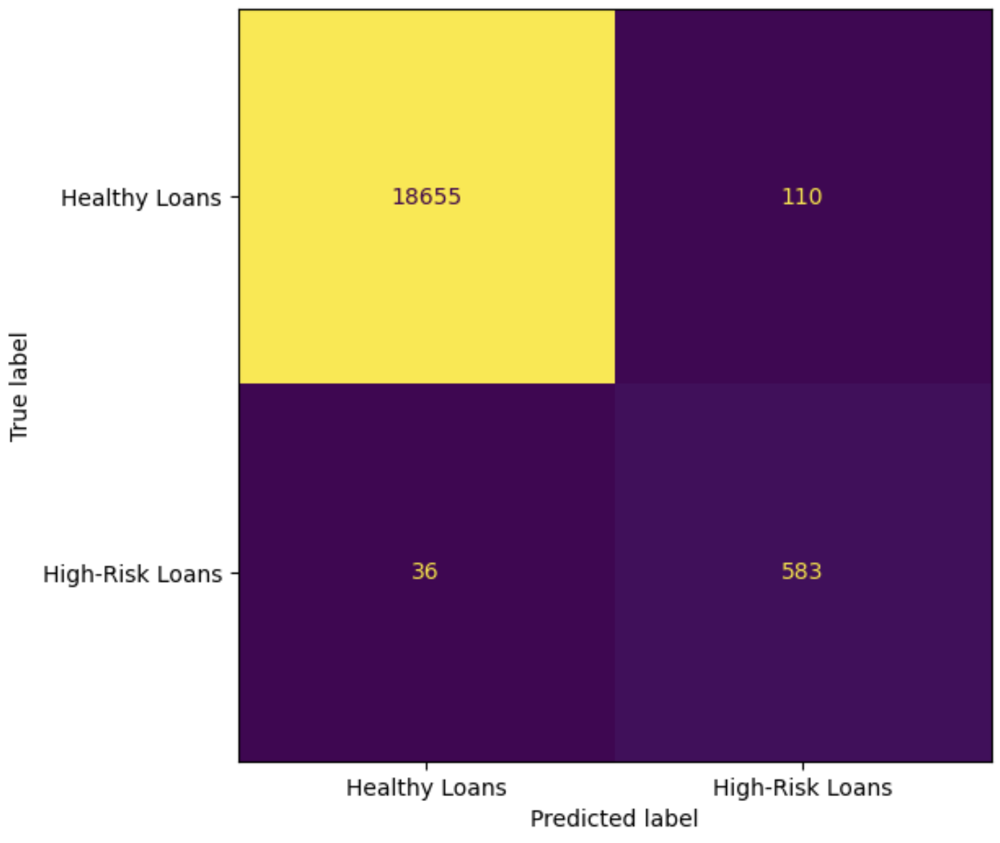

## Credit-risk Analysis with Logistic Regression Model

### Supervised Machine learning
## Overview of the Analysis
For this project, I worked with a dataset from a lending platform that recorded historical lending activity. 

The dataset included:
Key features like loan size, interest rate, borrower income, debt-to-income ratio, number of accounts held by the borrower, the number of derogatory remarks, and the borrower’s total debt. 

The label, or target variable, was the loan status, which indicates whether the loan was repaid or defaulted. 

## Dependencies used:
Scikit Learn and Pandas

## Model Design Process
1. Data Input
2. Split Data - test data
3. Model Training -test data
4. Model Evaluation
5. Model Deployment

## The result
* The classification report which takes into account the model's accuracy revealed that the healthy loans had a precision score of 100%, and a recall of 99%. For the non-healthy loans, the precision and recall were 84% and 99%, respectively. The overall performance of the model was calculated to be 99%.

* From the confusion matrix (Fig. 1) the logistic model predicted 18,663 as healthy loans correctly and 110 as healthy loans incorrectly from a total loan status of 18,655 which were healthy (i.e., low-risk).
* The model predicted 583 as high-risk loans correctly and 36 high-risk loans incorrectly from a total loan status of 619 which were high-risk.

### Summary
Using this information, I built a model aimed at predicting the creditworthiness of borrowers.

This model helps lenders gauge the risk of lending to a specific borrower, determine appropriate interest rates, and make informed decisions about whether to approve a loan. 

By utilizing historical borrower data and analyzing various financial factors, lenders can estimate the likelihood of default, leading to more reliable lending choices.

